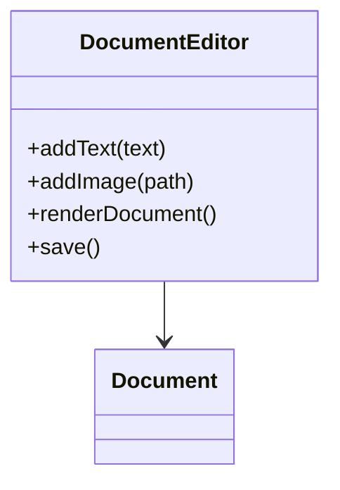

# Document Editor LLD — chat export

Exported from the Cursor session that produced the Document Editor problem, mock interview, implementation review, agent skills, and GitHub repo.

---

### You  
*Sunday, Sep 13, 2026, 6:35 PM (UTC+5:30)*

hi cursor, I had studies the SOLID design principles and was following this videos, - https://www.youtube.com/watch?v=MT9qZFGQXOU&list=PLQEaRBV9gAFvzp6XhcNFpk1WdOcyVo9qT&index=8 

So this is a problem solving video on SOLID principles so out of that I want you to extract the problem statement, the video clearly don't describe the problem state but describes the solutions here is the solution github link - 
https://github.com/adityatandon15/Low-Level-Design-Course/tree/main/Lecture%2007

you can create md file for the problem statement in the documentEditor module

### Assistant

I'll pull the lecture solution from GitHub and look at your `documentEditor` module so I can write a clear problem statement from the SOLID video.

The workspace looks like a small Java project, so I'll hunt for `documentEditor` and pull the lecture files from GitHub next.

I found Lecture 07 is a Document Editor LLD. Next I’ll read the Java solution and the video summary so the problem statement matches the actual design.

I have the lecture transcript. I’ll pull the Java APIs from the GitHub solution so the problem statement matches what the editor is actually expected to do.

I’ll add a standalone problem statement under a `documentEditor` package, based on the lecture’s requirements and APIs, without copying the solution design.

The problem statement is in `src/main/java/documentEditor/PROBLEM.md`.

The video never writes a formal spec. Around **00:35** it describes a simplified Google Docs editor, then jumps into a bad design and a SOLID rewrite. I reconstructed the problem from that intro plus the behavior in the [Lecture 07 solution](https://github.com/adityatandon15/Low-Level-Design-Course/tree/main/Lecture%2007).

**What you are asked to design**

A document editor the client talks to. The user inserts content in order, previews it as a string, and saves it.

**Must work now**
- Add text, image (by path), new line, and tab
- Keep mixed elements in insertion order
- Render to a string (`text` as-is, images as `[Image: path]`)
- Save the rendered document (file now; DB later without rewriting the editor)

**Must stay extensible**
- Tables, videos, fonts, bold/italic later should be new types, not `if-else` in render

**Interview constraint**
- Follow SOLID; do not put add / render / save in one class
- Bottom-up design; client uses a small facade

The markdown also includes the sample client flow, expected output, out-of-scope items (collab, undo, GUI), and the “monster class” anti-pattern from the video. It does **not** include the solution class diagram, so you can still solve it yourself.

---

### You  
*Sunday, Sep 13, 2026, 6:40 PM (UTC+5:30)*

hey you did great job, but can not add the funcitonal requirements and the solution part so that I can solve this myself without much hint, as in real interview scenarios there wont be direct requirements (most probably)

### Assistant

I'll strip the spec down to an interview-style prompt: the product idea only, no requirement list and no solution hints.

Updated. `PROBLEM.md` is now just the interview prompt: design a Document Editor like Google Docs, in LLD-interview time.

Gone: the feature table, render/save rules, client API, expected output, SOLID checklist, anti-pattern, and out-of-scope list. You’ll have to clarify scope and design it yourself, the way a real interview would go.

---

### You  
*Sunday, Sep 13, 2026, 6:42 PM (UTC+5:30)*

hi I think the problem has now very less details, not even the problem statement is there, is it like that in interviews as well, I had not experienced one for a long time ?

### Assistant

Interviews usually start that thin, then you pull out the rest by asking questions. For solo practice there’s no interviewer, so I’ll put back a short problem statement—the product idea only, not a spec or a solution.

Yes — **the opening line in an LLD interview is often that thin.** Someone says “Design a parking lot” or “Design Google Docs,” and that’s it. The spec is not handed to you.

What changes is that **the interviewer is sitting there.** You are expected to pull the rest out yourself:

1. Clarify users and the main flow (“who uses this, what’s the happy path?”).
2. Lock a tiny MVP (“text + images now; tables later”).
3. Cut scope (“no collab, no undo in 45 minutes”).
4. Then design classes, walk through a use case, handle a follow-up.

So the *prompt* is vague. The *requirements* still exist — you discover them by talking. Without an interviewer, a one-liner feels empty because nobody answers you.

That’s why `PROBLEM.md` now has a **problem statement**, not a requirements list: user edits a document, mixes text and images, wants to see it and save it, don’t clone all of Google Docs, keep it extensible. No API, no expected output, no SOLID checklist, no “don’t do X.”

When you practice, **play both roles**: write 4–5 clarifying questions, answer them, then design. That’s closer to the real round than a pre-written FR table.

---

### You  
*Sunday, Sep 13, 2026, 6:58 PM (UTC+5:30)*

hey lets assume you are the interviewer, so I had question regarding this line - 
> A user has a document on screen and edits it. They type some text, insert an image, type more text, and so on. At some point they want to see how the document looks, and they want to save it. 

Whey they type some text, does a single line of a document can have both text and image or on a single line there can be either only text or an image ?

### Assistant

A single line can mix both.

A “line” here is just whatever sits between two enters. The user can type some text, drop an image next to it, type more text — all on the same line — then hit enter when they want a break.

So we are **not** modeling “one block per line, and that block is either text or image.” Image is inline content, like in Docs/Word. Newline is its own action, not something we invent after every insert.

For this round, keep it simple: content is a sequence in the order the user added it. No wrapping, columns, or “image must be on its own line” rules.

If that matches how you were thinking about it, what’s the next thing you want to lock — what “see how it looks” and “save” mean in this round?

---

### You  
*Sunday, Sep 13, 2026, 7:01 PM (UTC+5:30)*

ya that was gonna be my next question, but before that just confirming that as content is a sequence in the order user added it, so there won't be anything like that user added this some say line 8/9 in the document

### Assistant

Correct — **not for this round**.

Treat the editor as “always insert at the end.” The user types, inserts an image, types again; each action is appended in that order. They are **not** saying “put this on line 8” or jumping the cursor into the middle of the document.

A real Docs/Word app would have a caret, click-to-place, insert-in-the-middle, maybe even “go to line N.” That’s a follow-up. If we have time at the end we can talk about how a position/cursor would plug in. For the design and code now, **append-only sequence** is enough.

So: no line numbers, no random insert, no edit-in-place of an old snippet. Add, then later render and save.

On that: when they “see how it looks,” do you want a real GUI, or is a rendered string / console preview enough for this interview? And for save — file, database, or both?

---

### You  
*Sunday, Sep 13, 2026, 7:04 PM (UTC+5:30)*

ohk next question, for see how it looks part and save it part, can you clarify a bit more like for this interview do we need to actually save this file in a file, or create a database setup and for the look part do we need to render this to an external device something like that ?

### Assistant

No GUI, no printer, no extra screen. **“See how it looks” means a rendered preview in this program** — a string you can print to the console is enough. Text shows as text; an image can be shown as a placeholder (path / `[Image: …]`), not actual pixels.

**Save:** persist that same rendered content. **Writing a local file is enough for this round** (`document.txt` or similar). I do **not** want you standing up MySQL, schemas, or JDBC in 45 minutes.

I *do* want the design to admit a second backend later (database, S3, …) without rewriting the editor. A stub “save to DB” is fine; a working file write is the one that should actually run.

So for the interview: **console preview + save to file**, with storage not glued to “only files forever.” If that scope is locked, we can move to entities and classes whenever you’re ready.

---

### You  
*Sunday, Sep 13, 2026, 7:04 PM (UTC+5:30)*

Great, Thanks!

### Assistant

You’re welcome.

Scope we locked: append-only sequence, mixed text and images on a line, console preview, real save-to-file, storage left open for a DB later.

Whenever you want to walk through entities, classes, or a review of your design, say the word.

---

### You  
*Sunday, Sep 13, 2026, 7:19 PM (UTC+5:30)*

hey, how can I show my class dig to the interviewer ?

### Assistant

I’ll check whether you already have a diagram in the project, then cover how to show it here and how people usually share one in a real LLD interview.

In a real LLD round you usually **draw it live**, not paste a finished UML dump.

**On-site / virtual whiteboard:** Excalidraw, Miro, interviewer’s board, or even boxes-and-arrows on paper. Draw while you talk: class name, 2–4 key methods, then lines (`has-a`, `is-a`). Interviewers care that you can explain it, not that PlantUML is perfect.

**Here, with me as interviewer, any of these work:**

1. **Paste Mermaid** in chat (I can read it as a class diagram):



2. **Paste a screenshot** of Excalidraw / draw.io / your notebook into the chat.
3. **Drop a file** in the repo (e.g. `documentEditor/class-diagram.png` or `.md` with Mermaid) and tell me the path.
4. **List classes in text** if drawing is slow:

```text
DocumentEditor
  - has Document
  - addText(), addImage(), renderDocument(), save()
```

Start with 4–6 classes and relationships. Don’t wait for a polished diagram — walk me through it as you would on a call. Paste whatever you have whenever you’re ready.

---

### You  
*Sunday, Sep 13, 2026, 7:33 PM (UTC+5:30)*

hey is tihs excalidraw dig accessible to you - https://excalidraw.com/#json=0ODuenee9dgag1qcrGhkU,5ZiqJYoieuSvd-a4PFYdhg ?

### Assistant

I’ll try opening that Excalidraw link. Share URLs often keep the scene in the hash, so a normal fetch may not see the diagram.

The page URL itself doesn’t include the drawing. I’ll fetch Excalidraw’s share API and decrypt the scene with the key from your link.

---

### You  
*Sunday, Sep 13, 2026, 7:34 PM (UTC+5:30)*

ohk here is the image

### Assistant

I can see the diagram. I’ll walk through it the way I would in the interview.

Yes — I can see this diagram. That’s a solid first cut.

What I like: **Document holds an ordered list of elements**, **Text / Image as subtypes**, and **Printer / Persistence as abstractions** with console and file implementations. That matches the scope we locked (preview + file save, storage not glued to files forever).

A few questions, same as I would ask on a call:

**1. Who adds content?**  
`Document` has `print`, `save`, `buildDoc`, but I don’t see `addText` / `addImage`. Does the client `new Text(...)` and poke the list, or does `Document` own that?

**2. Walk me through this:** user types `"Hello"`, inserts an image `cat.png`, hits enter, types `"World"`, then preview + save. Which objects are created, who calls whom, and what does `buildDoc` actually do?

**3. Newline / same-line mix.**  
We said a line can mix text and image, and enter is its own action. Is a newline a third element type, a special `Text("\n")`, or something `buildDoc` inserts?

**4. `DocumentElement.content` is a `String` for both.**  
For `Image`, is that the path? And does `Image.getContent()` already return something like a placeholder, or does `buildDoc` `if (element instanceof Image)`?

Answer those in whatever order you want. Start with the walkthrough if that’s easiest.

---

### You  
*Sunday, Sep 13, 2026, 7:47 PM (UTC+5:30)*

Update the implementation, to include addElement method.

Also added a client view how he calles

for the 3rd questionNo buildDoc does not have new line inclusion as the intial requirement does only states that append-only sequence, if new line is required it can be a new document element type.

for the 4th question, ya for the image as we agreed to have something like this [Image: ...] so I assumed that the content would be a path, so the content would look like [Image: abc.png] of maybe [Image: /dir/abc.png]. the getContent returns the formatted look of [Image: {content}], the setContent method directly sets the content variable to image path.

buildDoc does not do special handling, it just iterates over all documentElement and combines to them, and save it to the document variable so that other can use.

Also buildDoc would be called from print(), save() methods if the document string variable is empty.

### Assistant

I’ll look at the updated diagram and respond as the interviewer to your addElement, client flow, and the newline/image answers.

Got it — `addElement` plus the client flow closes the first gap. Answers on newline, image formatting, and `buildDoc` are consistent.

**Newline:** fine. Don’t invent enters. If we need one later, it’s another `DocumentElement` whose `getContent()` is `"\n"`. Same for tab.

**Image / `buildDoc`:** that’s the shape I want. `Image` knows how it looks (`[Image: path]`); `buildDoc` only concatenates. No `instanceof` in the loop. A future `Video` or `NewLine` shouldn’t force you to edit `buildDoc`.

A few follow-ups:

**1. Cache vs append.**  
`print()` / `save()` call `buildDoc()` only if `document` is empty. Walk this: `addText("Hi")` → `print()` → `addImage("cat.png")` → `print()` again. What does the second print show, and when do you rebuild?

**2. Who knows about `Text` / `Image`?**  
The client does `new Text("hi")` then `addElement`. So the caller is coupled to every concrete type. Alternative: `document.addText("hi")` / `addImage(path)` and `Document` constructs the element. Why did you put construction on the client?

**3. Wiring.**  
Client creates `Printer`, `Persistence`, and `Document`. How does `Document` get `p` and `ps` — constructor injection? If yes, sketch that constructor.

Answer those and we’re close to coding. If you want, next we can do a 2-minute SOLID check on `Document` itself (it currently stores, builds, prints, and saves).

---

### You  
*Sunday, Sep 13, 2026, 7:59 PM (UTC+5:30)*

> What does the second print show, and when do you rebuild?
Ya, this was missed to point in the earlier design, here can either rebuild the doc after each append or remove the document is empty check and build doc everytime print()/save() is called.

> Why did you put construction on the client?
Good point also good though to add the addText and addImage in the implementation only, but I actually narrowed it a bit initial thinking was like that lets keep the add method generic but didn't catch the consequence of the client now taking responsibility, better would be to have the addText and addImage implementations.

3. For wiring yes constructure injection.

### Assistant

Constructor injection and `addText` / `addImage` on `Document` are the right calls for this round. The client talks in product language; `Document` builds `Text` / `Image` internally.

**Cache — pick one.** Rebuilding on every `print()` / `save()` is simpler and always correct. Invalidating on each `add*` is an optimization. For this interview, **always `buildDoc()` on print/save** is enough. Drop the empty-string check, or clear `document` inside `addElement`. Don’t leave both stories half-true.

**`addElement` still public.** If `addText` / `addImage` exist so the client doesn’t construct types, keep `addElement` **internal** (private / package). Otherwise the client still does `new Text("hi")` and you’ve got two APIs. Public `addElement` is useful later for `NewLine` without adding `addNewLine` — that’s a tradeoff; say which you want.

**SOLID check on `Document` (2 minutes):**  
It stores elements, constructs types, builds the string, prints, and saves. Print and save are **delegated** to `Printer` / `Persistence`, so you’re not inlining `FileWriter` — that’s DIP and a reasonable SRP. The leftover tension: adding `Video` means opening `Document` for `addVideo` (OCP vs a nice facade). That’s an acceptable tradeoff if we say so out loud.

I wouldn’t split `Document` further unless we have time. This is shippable.

If you’re happy, implement it under `documentEditor` and we can review the code the same way. One happy-path `main`: text, image, text, print, save.

---

### You  
*Sunday, Sep 13, 2026, 8:01 PM (UTC+5:30)*

Got it :thumbs-up

### Assistant

Good. Implement when you’re ready and ping me for a code review — happy path: text, image, text, then print and save.

---

### You  
*Sunday, Sep 13, 2026, 8:03 PM (UTC+5:30)*

hey as I implement can you add the scope lockin and class dig in the our md file, as we are done with this.

### Assistant

Updated `src/main/java/documentEditor/PROBLEM.md` with two new sections:

- **Locked scope** — append-only, mixed line, console preview, file save, `[Image: path]`, always rebuild, `addText`/`addImage` as the public API, constructor injection
- **Class diagram** — Mermaid of the design we settled on (`addElement` / `buildDoc` internal)

The original problem statement is unchanged at the top. You can keep implementing against that file.

---

### You  
*Sunday, Sep 13, 2026, 8:04 PM (UTC+5:30)*

for the class dig, we can direct add the image its there in the same directory

### Assistant

Found `docEditorUML.png` beside the markdown. I'll swap the Mermaid diagram for that image.

The Mermaid block is gone. The class diagram section now embeds `docEditorUML.png` from the same folder, so it should render next to the locked scope in `PROBLEM.md`.

---

### You  
*Sunday, Sep 13, 2026, 8:42 PM (UTC+5:30)*

hey done with the implementation, can you review it

### Assistant

I’ll read through the `documentEditor` implementation and review it against the scope we locked.

This matches the locked scope. I traced the happy path against your `file-0.txt` … `file-2.txt` outputs: append-only, rebuild on every `print`/`save`, image as `[Image: abc.png]`, no extra newlines. I’d take this in an interview.

**What landed well**
- Constructor injection and client wiring (`ConsolePrinter` + `FilePersistence` + `Document`)
- Public API is `addText` / `addImage`; client never `new Text(...)`
- `buildDocument()` only concatenates `getContent()` — no `instanceof`
- You actually tested the cache case (`print`/`save` after each add), and the second/third saves grew correctly

**Fix if we still have 5 minutes**

1. **`elements`, `printer`, `persistence` are package-private.** `DocumentBuilderClient` is in the same package, so it can touch the list. Make them `private`. Same for `Image.path`.

2. **`setContent` on the `DocumentElement` interface.** We said no edit-in-place. After `addText`, nothing should mutate that element through the interface. Prefer `new Text(text)` / `new Image(path)` and drop `setContent` from the contract. That also helps a future `NewLine`: it shouldn’t have to implement a setter it doesn’t need.

3. **Private `addElement`.** `addText` and `addImage` both do `elements.add(...)`. One internal method is what we drew, and it’s the single place a `NewLine` would go later.

**Nits (say them, don’t over-rotate)**
- `document.concat` in a loop → `StringBuilder`
- `System.out.println` adds a newline that `save()` does not, so preview ≠ file
- `FilePersistence` writes `file-0.txt`, `file-1.txt`, … in the project root. Fine to demo multiple saves; for a real “Save” I’d overwrite one file (e.g. `document.txt`) and take a path in the constructor
- `Logger.getLogger(String.valueOf(FilePersistence.class))` → `FilePersistence.class.getName()`
- Broad `catch (Exception)` with only a log — at least print that save failed

**SOLID, as we left it:** `Document` still stores, builds, prints, and saves, but print/save are delegated. That’s the tradeoff we accepted. The leftover OCP hit is `addVideo` would open `Document` — same as discussed.

If you want, I can patch the private-fields / constructor / `addElement` items only and leave `FilePersistence` as-is.

---

### You  
*Sunday, Sep 13, 2026, 8:49 PM (UTC+5:30)*

hey fixed the pointers

### Assistant

I’ll re-read the updated files and check them against the review points.

The important review points are in.

**Done**
- `elements` / `printer` / `persistence` are `private final`
- `DocumentElement` is get-only; `Text` / `Image` take content in the constructor
- Private `addElement`
- `StringBuilder` in `buildDocument()`

That matches the design we locked.

**Still open (nits from last time)**
- `Image.path` is still package-private — make it `private` (and `final` if you want, same as `Text.content`)
- `FilePersistence` and `println` vs `save()` are unchanged. Fine to leave for this round

`clearDocument()` is unused in spirit now that you always assign `sb.toString()`; you could drop it. Not worth another pass unless you’re polishing.

I’d stop here and treat this as the interview solution. If you want a last compile/run check, I can run `DocumentBuilderClient`.

---

### You  
*Sunday, Sep 13, 2026, 8:52 PM (UTC+5:30)*

done, do your checks and give me result and time we elapsed.

### Assistant

**Checks:** compile succeeded (`./gradlew compileJava`). `DocumentBuilderClient` ran with exit code 0.

**Console (3 prints, document grows each time)**
1. `Hi, my document!`
2. `Hi, my document![Image: abc.png]`
3. `Hi, my document![Image: abc.png]next sentence`

**Files** (same strings, no extra newline — `print` uses `println`, `save` does not):

| File | Contents |
|---|---|
| `file-0.txt` | `Hi, my document!` |
| `file-1.txt` | `Hi, my document![Image: abc.png]` |
| `file-2.txt` | `Hi, my document![Image: abc.png]next sentence` |

That matches locked scope: append-only, mixed on one line, image placeholder, rebuild after each add.

**Review leftovers you closed:** `Image.path` / `Text.content` are `private final`; `clearDocument()` is gone.

**Verdict:** solution is complete for this round. Remaining nits (`FilePersistence` naming, `println` vs file) are optional.

---

**Time (wall clock, this chat)**

| Phase | When | Duration |
|---|---|---|
| Problem statement / interview format | 6:35–6:58 | ~23 min |
| Clarification + class diagram | 6:58–8:01 | ~1 h 3 min |
| Your implementation | 8:03–8:42 | ~39 min |
| Review + fixes | 8:42–8:52 | ~10 min |
| **Total session** | **6:35–8:52** | **~2 h 17 min** |
| **Mock interview (Q&A → working code)** | **6:58–8:52** | **~1 h 54 min** |

A real LLD slot is usually 45–60 minutes. We spent extra on writing the prompt, iterating the diagram, and a review pass. The core loop — clarify, lock scope, design, code — is in that interview-shaped range if you drop the meta discussion.

---
