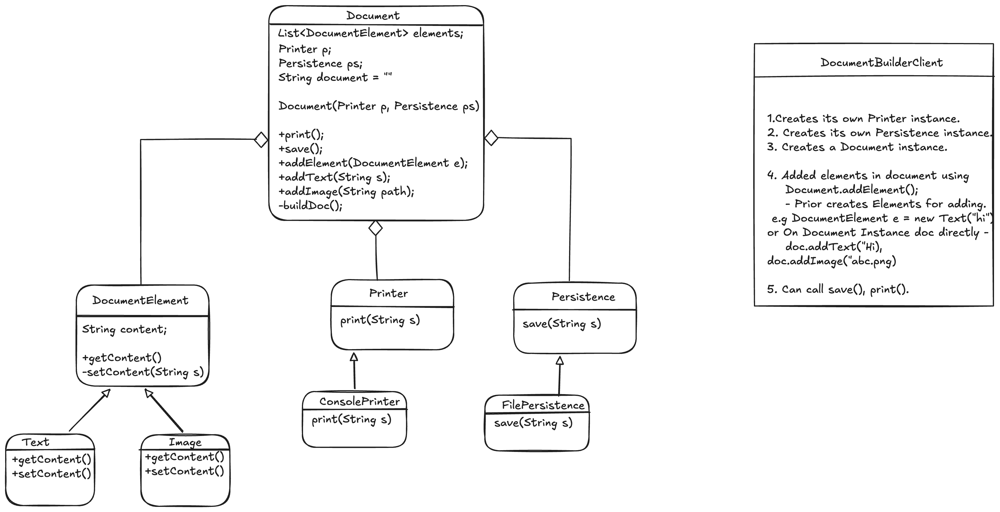

# Document Editor — Low-Level Design Problem

**Source:** Coder Army LLD Lecture 7 — [Build Google Docs | A Real-World LLD Project](https://www.youtube.com/watch?v=MT9qZFGQXOU&list=PLQEaRBV9gAFvzp6XhcNFpk1WdOcyVo9qT&index=8)

---

## Problem statement

Design a **Document Editor** — think Google Docs, not the full product.

A user has a document on screen and edits it. They type some text, insert an image, type more text, and so on. At some point they want to see how the document looks, and they want to save it.

You will not ship every Google Docs feature in one sitting. Pick a small slice that still feels like an editor, and keep the design open so new kinds of content can show up later.

This is an LLD interview-style problem: clarify the scope yourself, then produce a class design and a Java implementation under this package.

---

## Locked scope (interview)

Clarified with the interviewer. Implement against this, not the original one-liner.

- **Insert:** append-only, in the order the user added content. No cursor, no “put this on line 8,” no edit-in-place.
- **Layout:** a line can mix text and image. A line is whatever sits between enters. Newline is **not** inserted automatically. If we need enter/tab later, they are new `DocumentElement` types (`getContent()` → `"\n"` / `"\t"`).
- **Preview:** no GUI. `print()` sends a rendered string to the console.
- **Save:** write that same string to a local file. No real database in this round. `Persistence` exists so a DB/S3 backend can be swapped in later.
- **Render:**
  - `Text.getContent()` → the text
  - `Image.getContent()` → `[Image: {path}]` (`content` stores the path; formatting lives in `getContent()`)
  - `buildDoc()` concatenates every element’s `getContent()`. No `instanceof` / type switches.
- **Cache:** always `buildDoc()` on `print()` / `save()` (simpler and correct). Do not skip rebuild just because `document` is non-empty.
- **API:** client uses `addText` / `addImage`. `addElement` is internal. Client does not `new Text(...)`.
- **Wiring:** constructor injection — `Document(Printer p, Persistence ps)`. Client creates `ConsolePrinter`, `FilePersistence`, and `Document`.

Out of this round: collab, undo, caret, loading a file back, actually drawing pixels.

---

## Class diagram

Happy path for `DocumentBuilderClient`: add text, add image, add text, then `print()` and `save()`.
